<div align="center">
  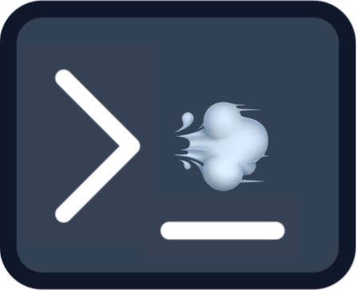

  <h1>Poof</h1>

  <p>
    A little pixel-art animation plays in your terminal every time you clear the screen.
  </p>

  <p>
    <a href="#one-line-install"><strong>⬇️ Install Poof</strong></a>
  </p>

  <p><strong>Requires macOS or Linux</strong></p>

  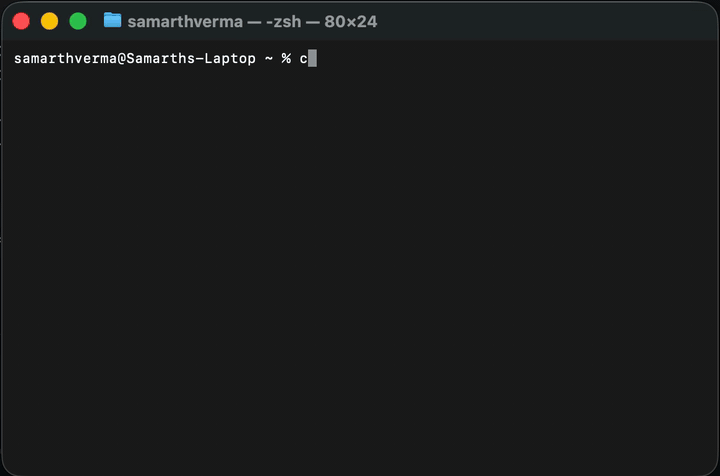

    dino - car - fireworks - helicopter - shark - surf - train - alien

</div>

## One-line Install

```sh
curl -fsSL https://raw.githubusercontent.com/MaybeSam05/poof/main/install.sh | bash
```

Then restart your terminal (or run `source ~/.bashrc`). Type `clear` and enjoy.

## Use it

After install, `clear`, `cls`, and `Ctrl+L` play the animation before clearing your terminal.

Set one animation:

```sh
poof car
poof surf
poof alien
poof rocket
poof dino
poof fireworks
poof train
poof helicopter
poof shark
```

Change how animations are picked:

```sh
poof random   # pick one at random each time
poof rotate   # cycle through every animation in order
```

Change speed:

```sh
poof car 0.5  # slower
poof car 2    # faster
```

Manage Poof:

```sh
poof preview  # play the current animation now
poof status   # show your current settings
poof disable  # turn animations off
poof enable   # turn animations back on
```

By default a random one plays. Use `poof rotate` to cycle through every animation in order.
Settings are remembered in `~/.config/poof/config`.

## Characters

| Preview | Command |
| --- | --- |
| 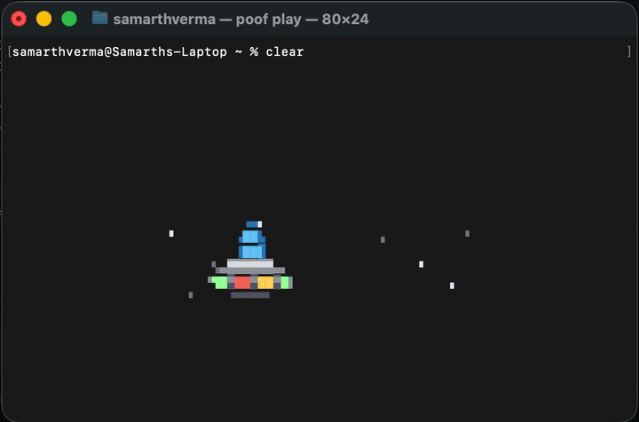 | `poof alien` |
| 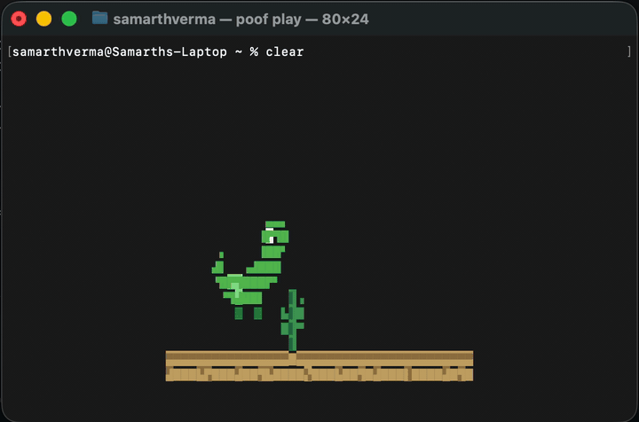 | `poof dino` |
| 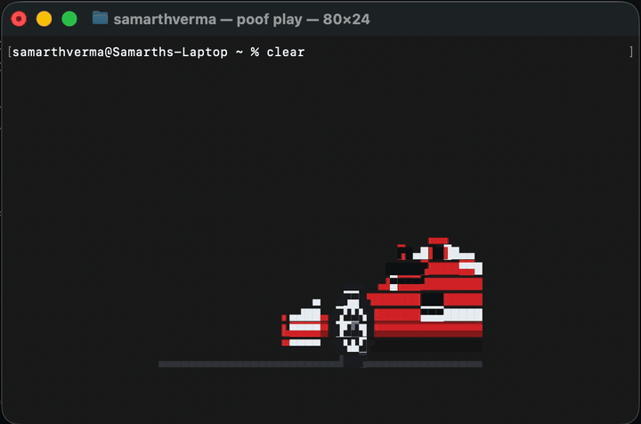 | `poof car` |
| 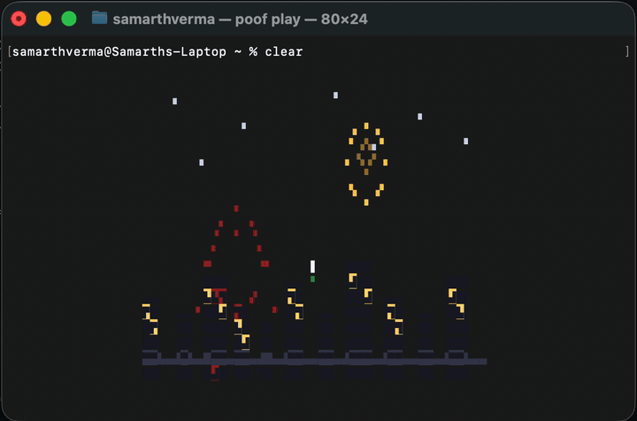 | `poof fireworks` |
| 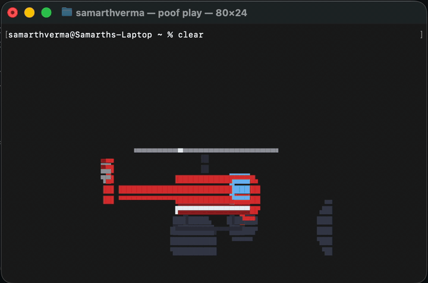 | `poof helicopter` |
| 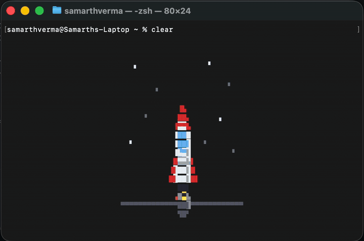 | `poof rocket` |
| 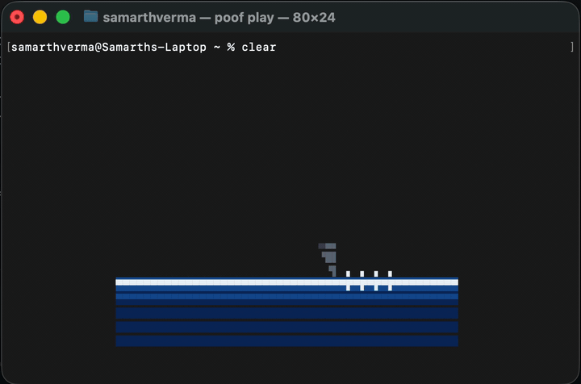 | `poof shark` |
| 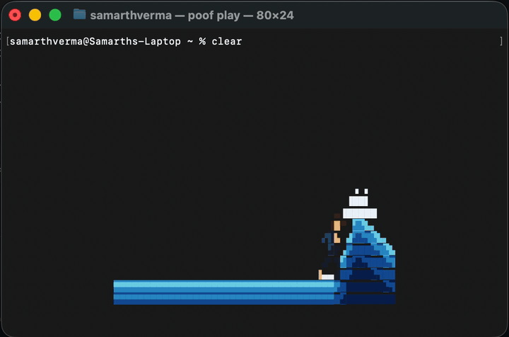 | `poof surf` |
| 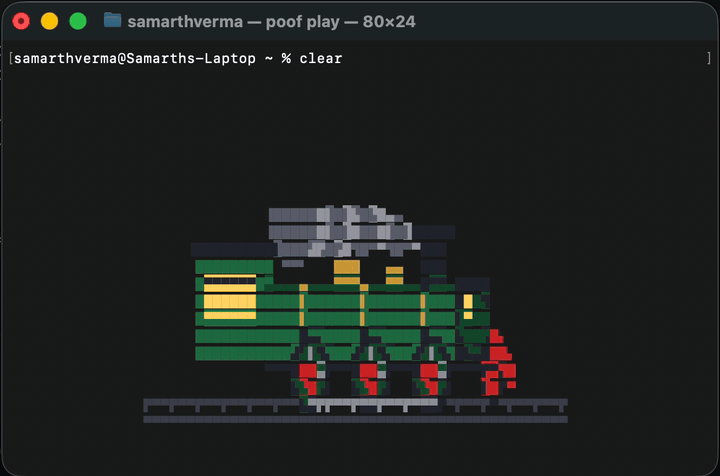 | `poof train` |

## Uninstall

```sh
poof uninstall
```

---

Build from source

Requires [Go](https://go.dev/dl/) 1.22+.

```sh
git clone https://github.com/MaybeSam05/poof && cd poof
go build -o poof ./cmd/poof
./poof preview          # try it
```

Add a new character in `internal/characters/<name>/` exposing `func Build() animation.Scene`
(compose sprites with the `renderer.Canvas` helpers), then register it in
`internal/characters/registry.go`.
